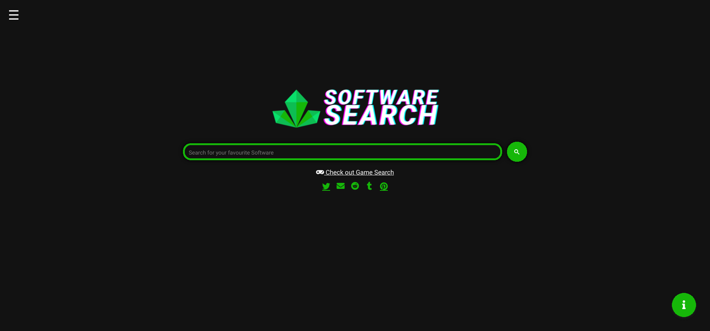
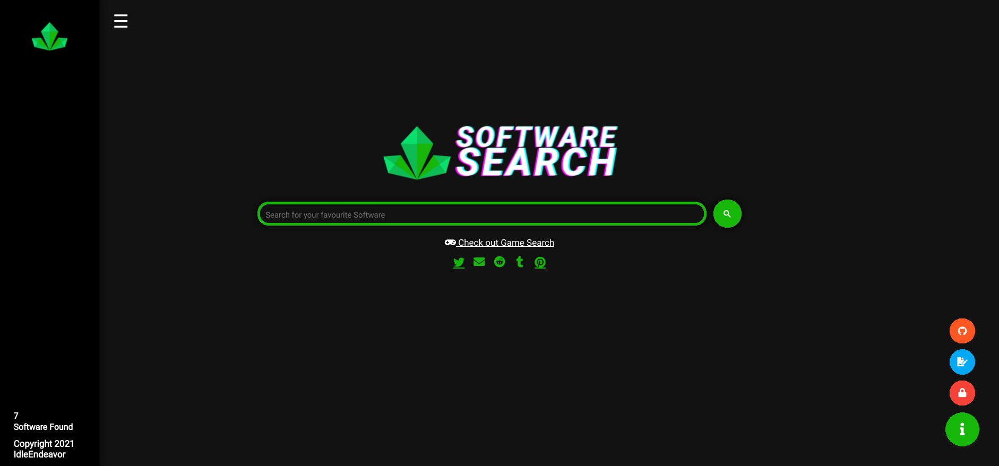

# Rave Software Search Engine
Rave Software Seach Engine assists users in discovering free Software downloads. It has a list of sources that are regularly updated and verified for safety as well as new Software download links.
All of the websites listed and indexed by the Rave Software Search Engine have been thoroughly verified to ensure their safety.

# Features
- Assists in the finding of free Software download links
- Only indexes links confirmed to be virus-free.
- Supports direct searches via browser address bars
- Uses Google search indexing to provide results quickly
- Simple UI for easy use

# Setting-up Direct URL Search
1. Visit the Search Engine settings on your browser
2. Click the '+', 'add new search engine' button (or an equivallent on your browser)
3. Fill in the required information:
  - Name: Rave Software Search
  - Nickname: rss
  - URL: https://ravesoftwaresearch.pages.dev/index.html?q=%s (please note that the '%s' keyword substitute may be different across browsers, kindly follow the instructions provided on your browser to replace if needed.) 

# Websites Indexed (Currently 38)
## Direct (Currently 14)
- https://macadmins.software/
- https://tb.rg-adguard.net/products.html
- https://tb.rg-adguard.net/index.php
- https://freedownloadae.com/
- https://gfx-hub.net/
- https://forum.gfxdomain.net/
- https://audioz.download/
- https://flsaudio.com/
- https://sanet.st/
- https://lrepacks.ru/
- https://repack.me/
- https://diakov.net/
- https://www.macbed.com
- https://nxmac.com
## Torrent (Currently 7)
- http://nnmclub.to/forum/viewforum.php?f=504
- https://web.archive.org/web/20180711192755/http://mirror.corenoc.de/digitalrivercontent.net/
- https://vstorrent.org/
- http://monkrus.ws/
- http://rutracker.org/
- https://1337x.to/
- https://rarbg.to/
## Android (Currently 12)
- https://dlandroid.com/
- https://blackmod.net/
- https://4pda.ru/forum/
- https://apkmos.com/
- https://apkhouse.com/
- https://apkmb.com/
- https://www.revdl.com/
- https://www.androeed.ru/
- https://github.com/ClaudiuGeorgiu/PlaystoreDownloader
- http://apps.evozi.com/apk-downloader/
- https://apkpure.com/
- https://www.apkmirror.com/
## iOS (Currently 5)
- https://cydia.kiiimo.org/
- https://cydiageek.yourepo.com/
- https://cydia.iphonecake.com/
- https://rejail.ru/
- https://julio.hackyouriphone.org/

# Additional Info
## Terms of Use
The purpose of this website is to compile a list of Software download links from external websites.
The user is responsible for any actions taken in response to the Rave Software Search Engine's results.
With its information, this website does not advocate or discourage any behaviors. Rave Search contains only pure, unfettered material.
IdleEndeavor owns the Rave Software Search logo and all other brand material. External usage of this information is prohibited.

## Privacy Policy
The Rave Software Search Engine does not collect or retain any personally identifiable information.
This website does not utilize Analytics in any way for its own purposes except a basic searches-completed counter, and its servers do not keep track of how it is used.
Rave Software Search Engine's search functions are built on Google Search Services. As a result, Google may gather use or analytics data from visitors of this site. This data gathering is not the responsibility of Rave Search.
We realize you as a user's right to privacy and will strive to respect it at every step of the way, as much as we can.

## Licence
All of the code for the Rave search engine is available to the public and may be copied and modified for personal use. Forks, clones or other modifications are not allowed to be made public.
IdleEndeavor owns all of the Rave Search Engine's brand material and logos. They must not be copied, changed, or utilized in conjunction with the copied search engine code or in any other way.
